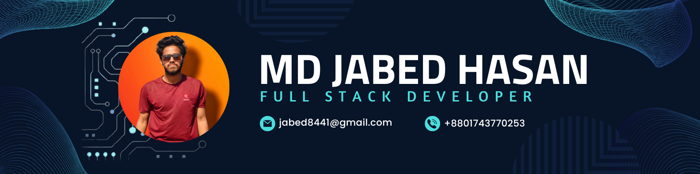

<head>
  <!-- Font Awesome CDN for icons -->
  <link href="https://cdnjs.cloudflare.com/ajax/libs/font-awesome/6.0.0-beta3/css/all.min.css" rel="stylesheet">
</head>

  

<h1 align="center">👋 Hi, I'm Md Jabed Hasan</h1>
<h3 align="center">🚀 Full Stack Developer | TypeScript | Next.js | Express.js | MongoDB</h3>

  

---

## 🧠 About Me

I'm a passionate Full Stack Developer with expertise in modern web technologies.  
I specialize in building **secure**, **scalable**, and **user-friendly** applications using:

- **TypeScript**, **Express.js**, **Mongoose**, **Next.js**
- Currently exploring **PostgreSQL**, **Prisma**, **GraphQL**, **Docker**, and **AWS**

🎯 **2025–2026 Goals**:
- Master modern backend & cloud tools
- Lead impactful real-world projects
- Grow into a confident and well-rounded **Senior Software Engineer**

---

## 🔨 Currently Working On

- 🏆 A **Contest Creation Platform** (full-stack project)

---

## 🌐 Portfolio

- 🔗 [portfolio-jabeds-projects.vercel.app](https://portfolio-jabeds-projects.vercel.app/)

---
## 📫 Contact Me

  
  &nbsp;
  
  &nbsp;
  
  &nbsp;
  
  &nbsp;
  

---

## 🧰 Tech Stack

### 💻 Frontend

  

### 🛠️ Backend

  
  
  
  
  
  
  
  
  
  
  
  

---

## 🧪 Tools

  
  
  
  
  

---

## 💡 Interpersonal Skills

- 🤔 Curiosity  
- 👂 Active Listening  
- 🧠 Responsibility  
- 🔄 Flexibility  
- ✅ Decision-Making  

---

## 📊 GitHub Stats

  
   
  
   
  

---

## 🏆 GitHub Trophies

  

